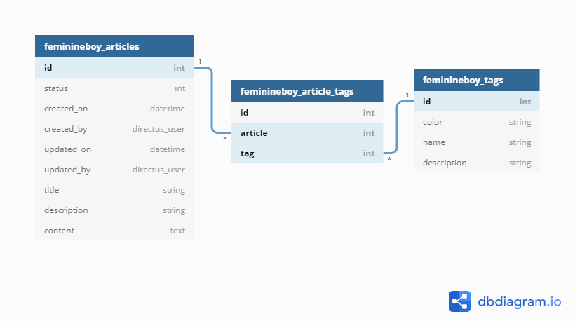

# Directus setup
**Website:** https://directus.io  
**Documentation** https://docs.directus.io/  
**Quick start:** https://docs.directus.io/getting-started/quickstart/  
**Tutorial video:** https://www.youtube.com/watch?v=AicEmIeuuLw

## Data structure
If you want your local instance of the website to use your Directus instance you have to make sure to create your collections exactly according to the scheme here.

### feminineboy_articles
- **id:** auto increment integer
- Optional System fields:
    - **Status:** Yes
    - **Created On:** Yes
    - **Created By:** Yes
    - **Updated On:** Yes
    - **Updated By:** Yes
    
- **title:**
    - Type: string
    - Length: 100
    - Required: Yes
    - Interface: Text Input
    - Trim: Yes
    - Display: Formatted Value

- **tags:**
    - Type: Many to Many
    - Relationship:
        - Auto Fill: No
        - Junction Collection:
            - Name: feminineboy_article_tags
            - Foregin Key (This collection): article
            - Foregin Key (Related collection): tag
        - Related Collection: feminineboy_article
        - Create corresponding field: No
    - Display: Related Value

- **description:**
    - Type: string
    - Length: 200
    - Required: Yes
    - Interface: Text Input
    - Trim: Yes
    - Display: Formatted Value

- **content:**
    - Type: Text
    - Required: Yes
    - Interface: Markdown
    - Trim: Yes
    - Display: Formatted Value

### feminineboy_tags
- **id:** auto increment integer
- Optional System fields: None
- **color:**
    - Type: string
    - Default value: #E851A4
    - Required: Yes
    - Interface: Color
    - Display: Color
    
- **name:**
    - Type: String
    - Length: 16
    - Required: Yes
    - Unique: Yes
    - Interface: Text Input
    - Trim: Yes
    - Display: Raw Value

- **description:**
    - Type: String
    - Length: 80
    - Required: Yes
    - Interface: Text Input
    - Trim: Yes
    - Display: Formatted Value
    
## Relationship diagram
After setup, the collections should conform to this diagram:

## Permissions
Make sure that the role of the user you are accessing Directus with (usually "public") has the necessary read permissions for the collections.
Otherwise, you may get an exception on the website.